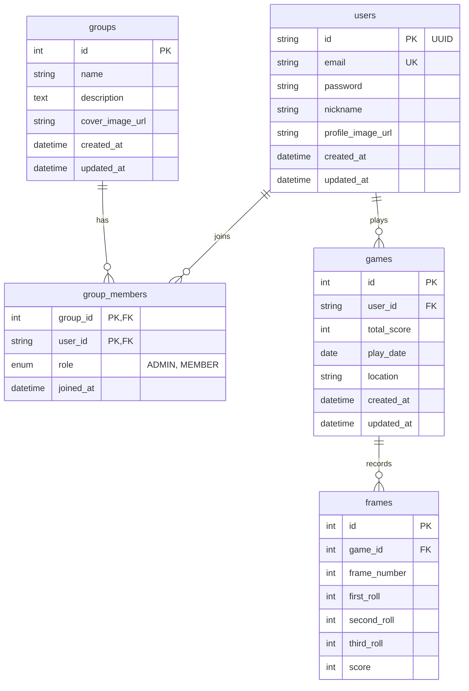

# Strike Log API (flutter_bowling_api)

스트라이크 로그(Strike Log) 앱의 백엔드를 담당하는 API 서버입니다. 
볼링 점수 및기록 관리, 사용자 및 클럽(그룹) 기능, 통계 조회 등을 제공합니다.

## 기술 스택
- **Framework**: NestJS (Node.js)
- **Database**: MySQL, TypeORM
- **Authentication**: Supabase Auth 연동 고려 (현재 자체 이메일/비밀번호 및 sync 제공)
- **Language**: TypeScript

---

## DB 관계도 (ERD)



---

## API 설계도

### 1. 사용자 및 인증 (`/users`, `/email`)
- `POST /email/send-otp` : 이메일 인증번호 발송 요청
- `POST /email/verify-otp` : 이메일 인증번호 확인
- `POST /users/signup` : 이메일 및 비밀번호를 통한 회원가입
- `POST /users/login` : 이메일/비밀번호 로그인
- `POST /users/sync` : 외부 혹은 클라이언트 로그인 후 유저 정보 DB 동기화
- `GET /users/:id` : 내 프로필 정보 조회
- `PATCH /users/:id` : 프로필 업데이트 (닉네임, 프로필 이미지)

### 2. 게임 기록 및 통계 (`/games`)
- `POST /games` : 신규 게임 기록 생성 (각 프레임별 점수 포함)
- `GET /games/me/:user_id` : 유저의 전체/특정 기간 게임 목록 조회
- `GET /games/:id/detail/:user_id` : 특정 게임의 상세 정보(프레임 상세점수 등) 조회
- `GET /games/users/:user_id/recent` : 가장 최근에 플레이한 게임 1건 요약 조회
- `GET /games/users/:user_id/statistics` : 유저의 볼링 통계(평균 점수, 최고 점수, 최근 10게임 등) 조회

### 3. 클럽(그룹) 관리 (`/groups`)
- `POST /groups` : 신규 클럽 생성
- `GET /groups` : 전체 클럽 목록 조회
- `GET /groups/me/:user_id` : 내가 가입된 클럽 목록 반환
- `GET /groups/:id` : 특정 클럽 기본 정보 조회
- `POST /groups/:id/join` : 특정 클럽에 가입
- `GET /groups/:id/members` : 특정 클럽에 소속된 멤버 리스트 반환

---

## 프로젝트 실행 방법

```bash
# 의존성 설치
$ npm install

# 개발 모드 실행
$ npm run start:dev

# 프로덕션 빌드 및 실행
$ npm run build
$ npm run start:prod
```
